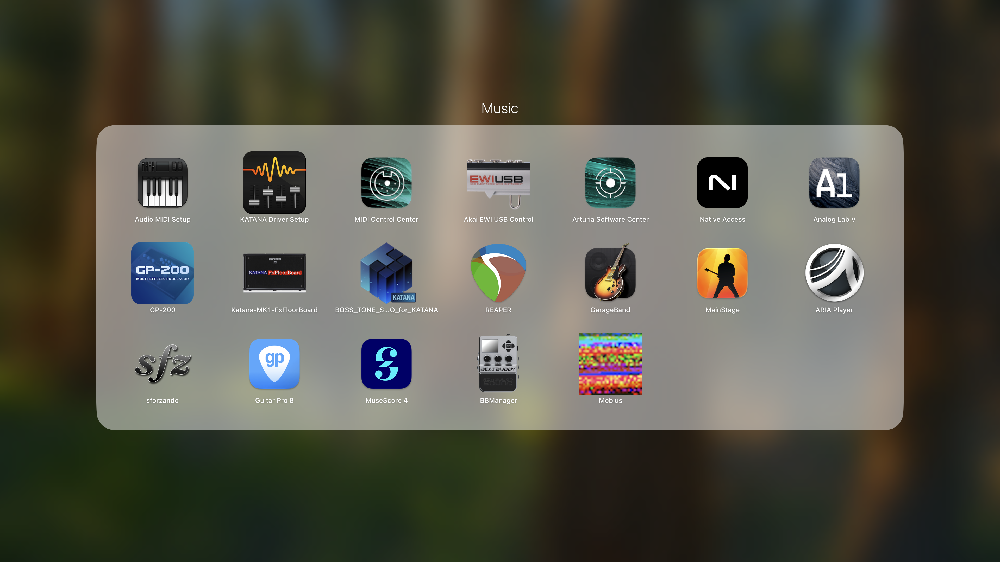
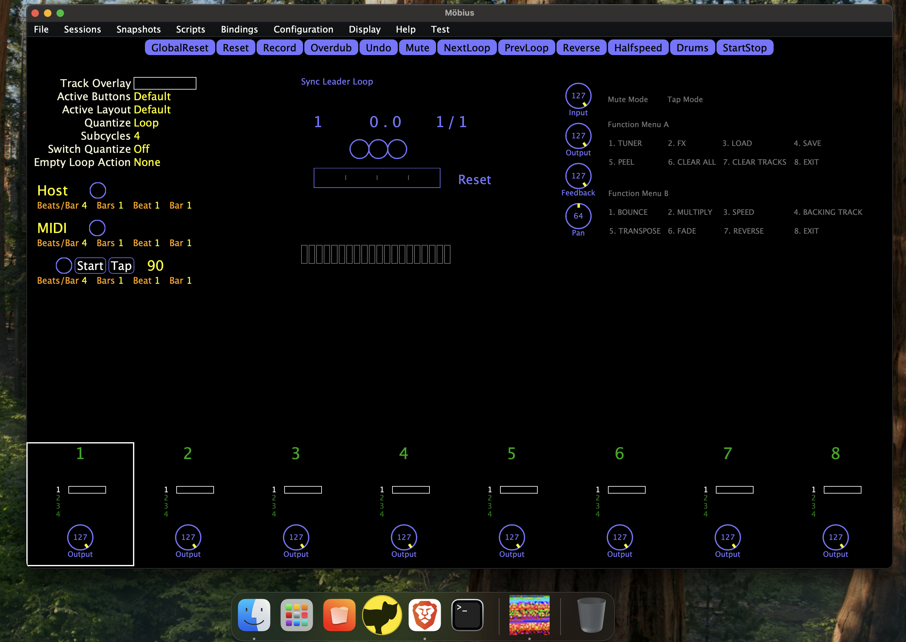
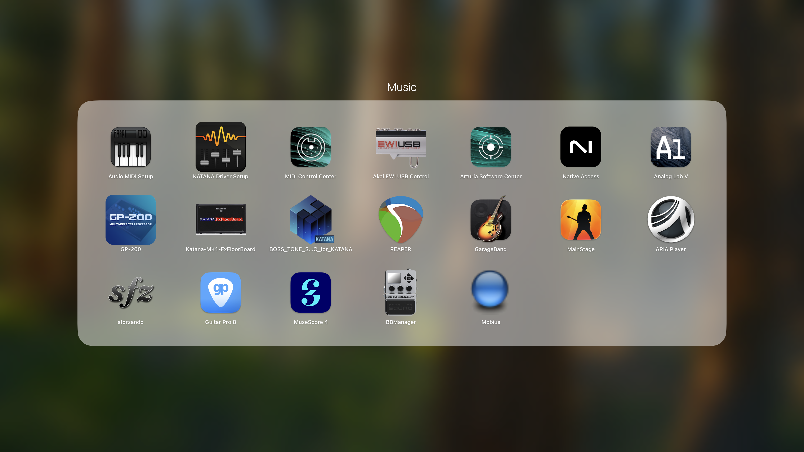
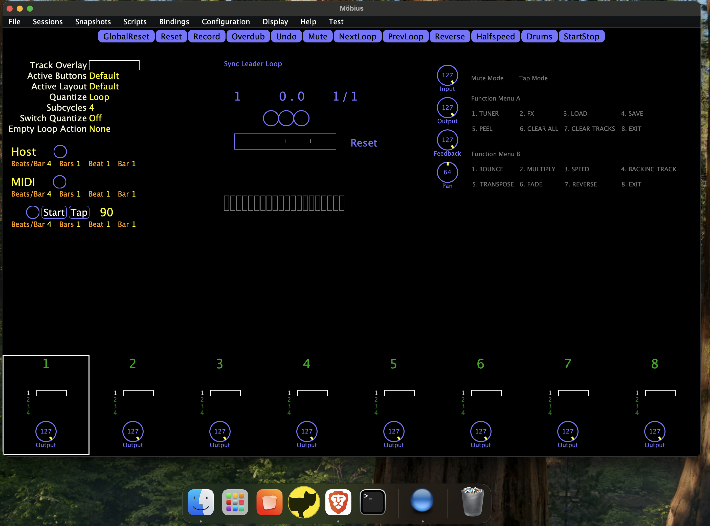
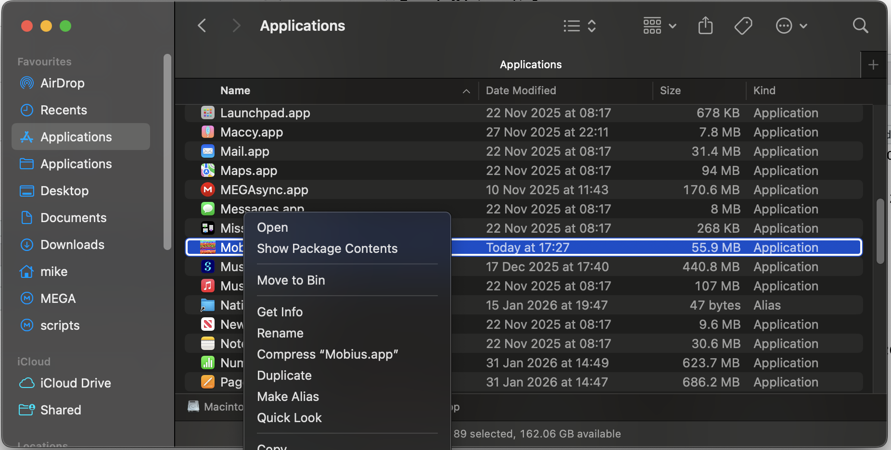
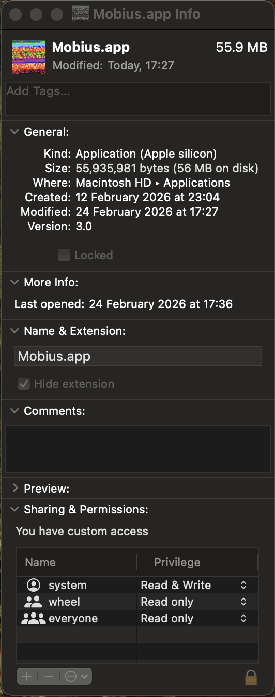

---
title: Möbius icon workaround for Mac
---  

One minor niggle with Möbius 3 on the Mac is that the application icon for the 
standalone version appears corrupted when viewed in Launchpad and the Dock as shown below:

{width="48%" fig-align="center"}
{width="48%" fig-align="center"}

This seems to be down to a problem with the "Icon.icns" file embedded within the app.
I have created a modified Icon.icns file which can be used to workaround the issue so that you will get something closer to Jeff's intended images:

{width="48%" fig-align="center"}
{width="48%" fig-align="center"}

## Workaround Steps

1. [Download the Icon.icns file](resources/Icon.icns)
2. Open Finder, go to Applications, right click on Mobius.app and select Get Info.
{width="50%" fig-align="center"}   
This will open an Info window for the Mobius app.  
{width="15%" fig-align="center"}
3. Go back to Finder and navigate to wherever you downloaded the Icon.icns file from step 1. Select the Icon.icns file and drag and drop it onto the garbled image at the top left of the Mobius.app info window. You will be asked to enter your password to allow Finder to update the app image. It won't look like the image has changed at this point but close the Info window anyway.
4. You should now see the Mobius icon in all its glory in Launchpad, Finder, and the Dock.

